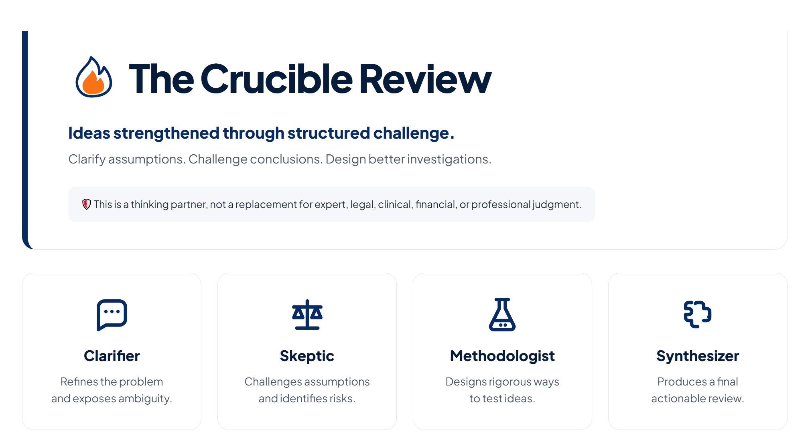
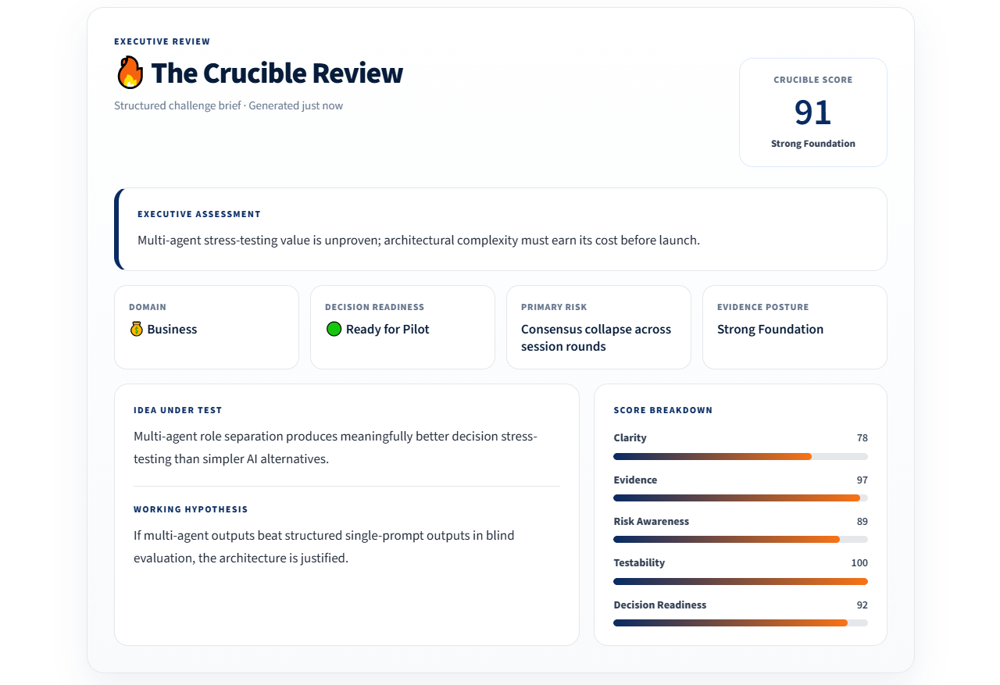
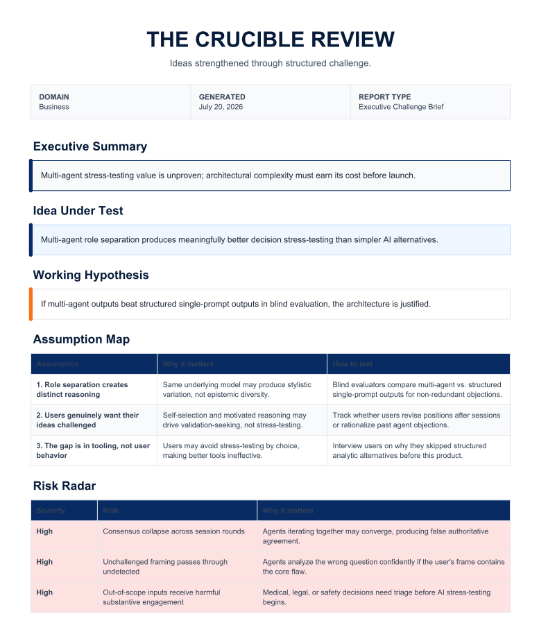

# ⚖️ The Crucible Review

> **Ideas strengthened through structured challenge.**

The Crucible Review is an AI-powered adversarial thinking partner that helps users stress-test ideas before making important decisions.

Instead of generating a single answer, it orchestrates four specialized AI reviewers to clarify assumptions, challenge weak reasoning, evaluate methodology, and synthesize actionable recommendations into an executive-ready decision brief.

The goal is not to replace human judgment.. it is to sharpen it!

---

## 🚀 Live Demo

**🌐 Application:** https://crucible-review.streamlit.app/

No installation required.

---

## 📸 Demo



> *The Crucible Review transforms a single idea into a structured executive decision brief.*

---

# Why I Built This

Modern AI tools are excellent at generating answers.

However, answers are only as good as the thinking behind them.

Most AI assistants optimize for producing solutions.

**The Crucible Review optimizes for improving reasoning.**

Instead of accepting the first answer, users are encouraged to challenge assumptions, expose blind spots, evaluate evidence, and strengthen decisions before acting.

Whether you're evaluating a research proposal, startup concept, product strategy, career move, or operational problem, The Crucible Review acts as an AI thinking partner, not simply an answer engine.

---

# ✨ Features

- 🤖 Multi-agent adversarial reasoning workflow
- 🔍 Assumption mapping
- 🚩 Risk and blind spot identification
- 📐 Methodology evaluation
- 📋 Executive decision briefs
- 📄 Downloadable PDF reports
- ⚡ Interactive Streamlit interface
- ☁️ Cloud deployed for public access

---

# 🧠 Multi-Agent Architecture

The Crucible Review follows a structured four-agent reasoning pipeline.

```
                User Idea
                    │
                    ▼
             🔦 Clarifier
        Refines the problem
                    │
                    ▼
              🚩 Skeptic
     Challenges assumptions
                    │
                    ▼
          📐 Methodologist
     Evaluates rigor & evidence
                    │
                    ▼
            🧩 Synthesizer
 Combines insights into a decision brief
                    │
                    ▼
      Executive Report + PDF Export
```

---

## 🔦 Clarifier

Clarifies ambiguous problem statements, identifies missing context, and ensures the idea is ready for rigorous evaluation.

---

## 🚩 Skeptic

Challenges assumptions, identifies risks, explores alternative viewpoints, and highlights potential failure modes.

---

## 📐 Methodologist

Evaluates whether the proposed reasoning is logically sound, evidence-based, and methodologically rigorous.

---

## 🧩 Synthesizer

Integrates insights from all reviewers into a structured executive report with actionable recommendations.

---

# 📄 Example Executive Report



The final report includes:

- Executive Summary
- Working Hypothesis
- Assumption Map
- Risk Radar
- Critical Evidence
- Recommended Actions
- Challenge Cards
- Behind the Analysis

---

# 📑 Executive PDF Export



Every review can be exported as a professionally formatted PDF suitable for sharing, documentation, or future reference.

---

# 💡 Example Use Cases

The Crucible Review is intentionally domain-agnostic.

It can be used for:

- 🎓 Research proposal evaluation
- 🚀 Startup idea validation
- 💼 Product strategy reviews
- 📊 Business process improvement
- 🧠 AI system design
- 🏛 Policy and operational planning
- 🎯 Career decision analysis
- 🏠 Personal decision-making

---

# 🏗 Technology Stack

| Layer | Technology |
|--------|------------|
| Frontend | Streamlit |
| Language | Python |
| LLM | Anthropic Claude |
| PDF Generation | ReportLab |
| Environment | python-dotenv |
| Deployment | Streamlit Community Cloud |
| Version Control | Git & GitHub |

---

# 📂 Project Structure

```text
crucible-review/
│
├── app.py
├── agents.py
├── prompts.py
├── pdf_generator.py
├── requirements.txt
├── README.md
├── images/
│   ├── dashboard.PNG
│   ├── report.PNG
│   └── pdf.PNG
├── .gitignore
└── .env
```

---

# ⚙️ Installation

Clone the repository.

```bash
git clone https://github.com/adithideborah/crucible-review.git
cd crucible-review
```

Create a virtual environment.

```bash
python -m venv .venv
```

Activate it.

Windows

```bash
.venv\Scripts\activate
```

macOS/Linux

```bash
source .venv/bin/activate
```

Install dependencies.

```bash
pip install -r requirements.txt
```

Create a `.env` file.

```env
ANTHROPIC_API_KEY=your_api_key_here
```

Run the application.

```bash
streamlit run app.py
```

---

# 🔐 Environment Variables

Required:

```env
ANTHROPIC_API_KEY=your_api_key_here
```

Never commit API keys or `.env` files to source control.

---

# 🎯 Design Philosophy

Most AI systems optimize for producing answers.

The Crucible Review is designed to improve the quality of thinking itself.

By introducing structured disagreement through specialized AI reviewers, it encourages users to question assumptions, identify blind spots, and make more informed decisions before taking action.

---

# 🛣 Roadmap

Future directions include:

- 👤 User accounts and saved review history
- 🤝 Collaborative reviews
- 🧩 Domain-specific review templates
- 🧠 Additional reviewer personas
- 🔄 Comparative multi-model analysis
- 📈 Usage analytics and insights
- 🌐 Enterprise deployment options

---

# 👩‍💻 Author

**Dr. Adithi Deborah Chakravarthy**

Ph.D. in Information Technology

GitHub: https://github.com/adithideborah

LinkedIn: https://www.linkedin.com/in/adithideborah

---

# 📜 License

This project is released for educational, research, and portfolio purposes.

---

## ⭐ If you find this project interesting...

Consider giving the repository a ⭐ on GitHub!